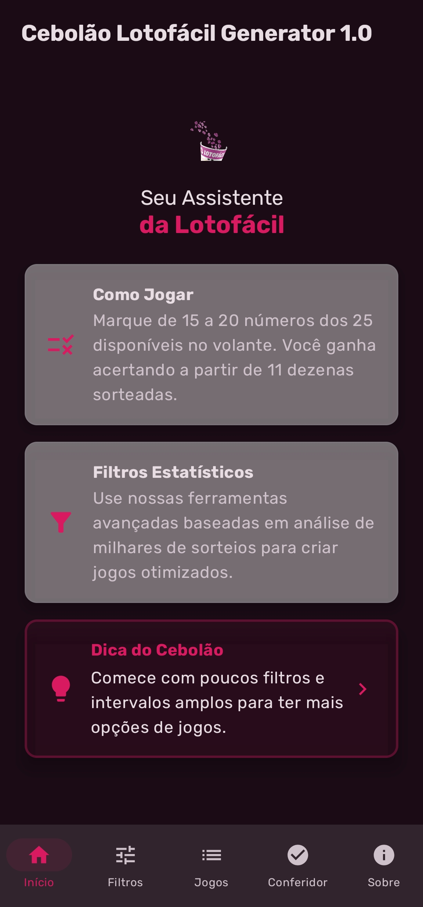
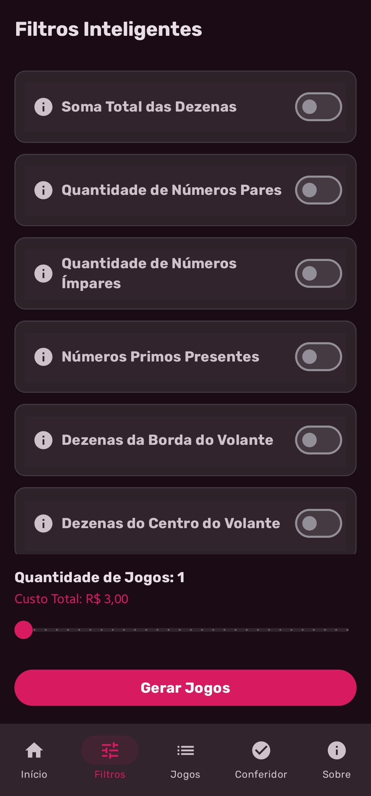
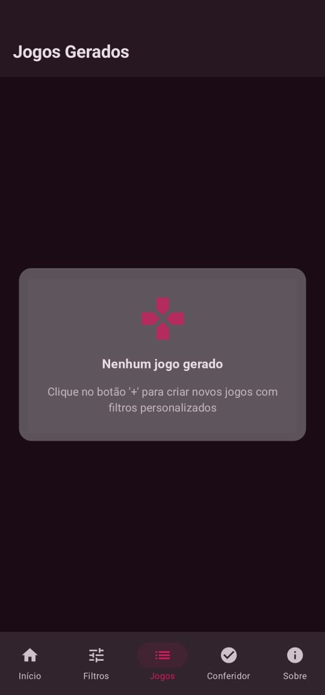
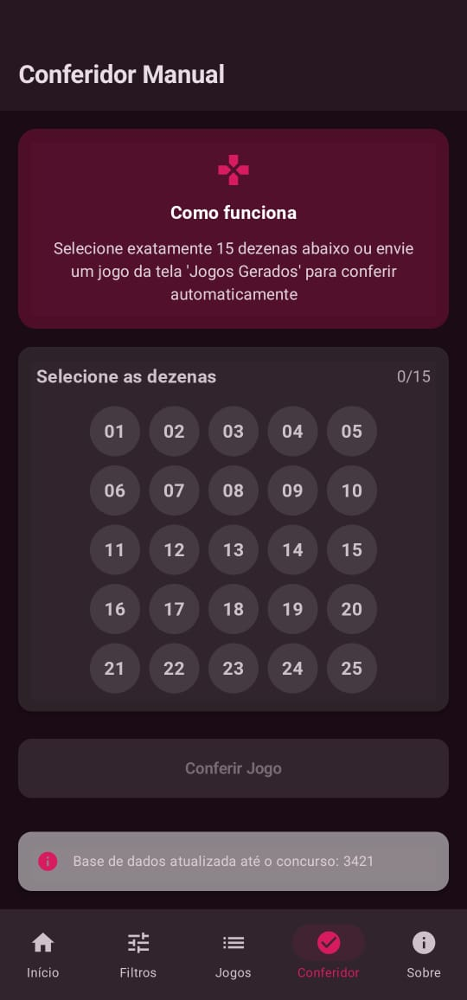

# 🎲 Cebolao Lotofácil Generator

*"Para apostadores que preferem estatísticas à sorte cega."*  

[](https://developer.android.com)
[](https://kotlinlang.org)
[](https://developer.android.com/jetpack/compose)
[](LICENSE)

<p align="center"><b>Feito com ❤️ e algoritmos pela Cebola Studios</b></p>

---

## 📱 Telas do Aplicativo

| Tela Inicial | Gerador de Jogos | Jogos Gerados | Conferência de Jogos |
|--------------|------------------|---------------|-----------------------|
|  |  |  |  |

---

## ✨ Funcionalidades Principais
 
- **Gerador Inteligente:**  
  - 9 filtros estatísticos (soma de dezenas, pares/ímpares, primos, Fibonacci, etc.).  
  - Feedback inteligente se a geração falhar (*"O filtro X está muito restritivo!"*).  
- **Conferidor Histórico:**  
  - Analise qualquer combinação contra 3400+ concursos.  
  - Relatório detalhado: *"Seu jogo fez 15 pontos 2 vezes, a última em 2015."*  
- **UI Moderna:**  
  - Tema escuro personalizado, fonte Inter, microanimações fluidas.  
  - Totalmente acessível (TalkBack).  

---

## 🛠️ Stack Tecnológica

- **Linguagem:** Kotlin 2.0  
- **UI:** Jetpack Compose  
- **Arquitetura:** MVVM + SOLID  
- **Testes:** JUnit4, MockK, Espresso  
- **Performance:** `derivedStateOf`, `Dispatchers.IO`, algoritmos otimizados.  

---

## ⚙️ Como Executar o Projeto

1.  Clone este repositório:
    ```bash
    git clone https://github.com/SEU-USUARIO/cebolao-generator.git
    ```
2.  Abra o projeto no [Android Studio](https://developer.android.com/studio) (versão Iguana ou superior recomendada).
3.  Aguarde o Gradle sincronizar as dependências.
4.  Execute o aplicativo em um emulador ou dispositivo físico (API 26+).

---

## 📄 Licença

Este projeto está sob a licença MIT. Veja o arquivo `LICENSE` para mais detalhes.