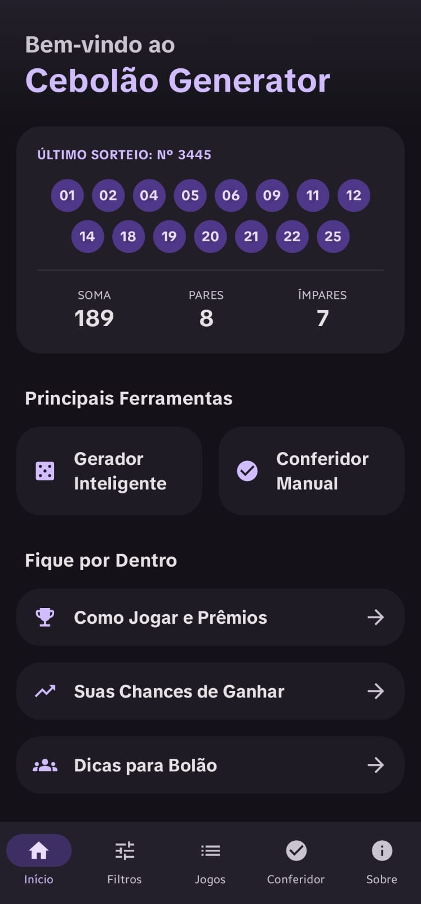
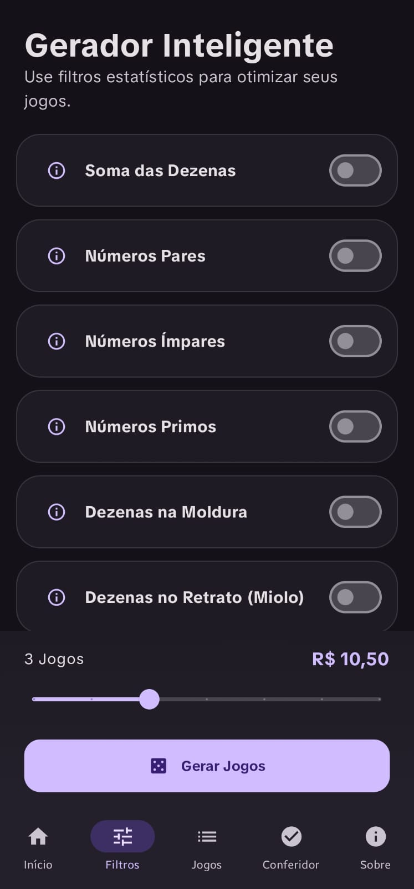
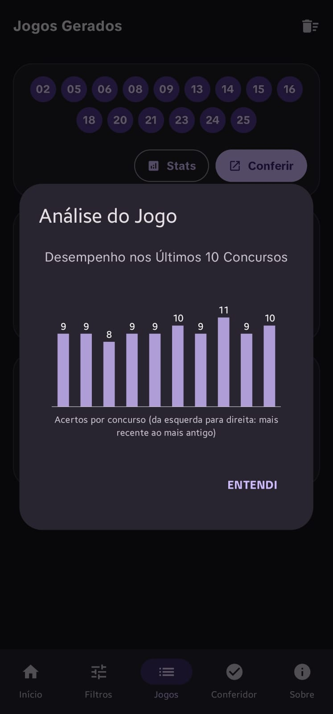
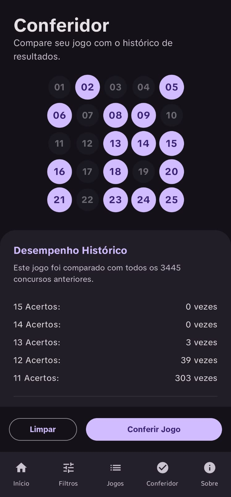

# 🎲 Cebolao Lotofácil Generator

Uma solução da Cebola Studios para gerar jogos da Lotofácil com estatísticas – porque a sorte é para amadores, mas a matemática não promete milagres.

## ✨ Funcionalidades Principais
- 🧮 Gerador com 9 filtros estatísticos baseados em histórico.
- 🔍 Conferidor de jogos contra dados históricos.
- 📊 Análises de padrões e tendências.
- 🎨 Interface moderna com tema escuro e acessibilidade.
- ⚠️ Avisos para filtros restritivos e validações.
- 
## 🛠️ Stack Tecnológica
- **Linguagem**: Kotlin 2.0.0
- **UI**: Jetpack Compose 2024.06
- **Arquitetura**: MVVM com Clean Architecture
- **Testes**: JUnit4 e Espresso
- **Threading**: Coroutines 1.7.3
- 
## 📸 Screenshots

| Tela Inicial | Gerador | Jogos Gerados | Conferência |
|--------------|---------|---------------|-------------|
|  |  |  |  |

## 🚀 Instalação
1. Clone o repositório: `git clone https://github.com/cebola-studios/cebolao-generator.git`
2. Abra no Android Studio e sincronize o Gradle.
3. Execute: `./gradlew build`

## 🏗️ Estrutura do Projeto
- `app/src/main/`: Código principal (data, logic, ui).
- `app/src/test/`: Testes unitários.
- `screenshots/`: Imagens da documentação.

## 🧪 Testes
Execute: `./gradlew test`

## 📄 Licença
Licença MIT. Jogue com responsabilidade – a Cebola Studios não reembolsa apostas perdidas.
Desenvolvido pela Cebola Studios.